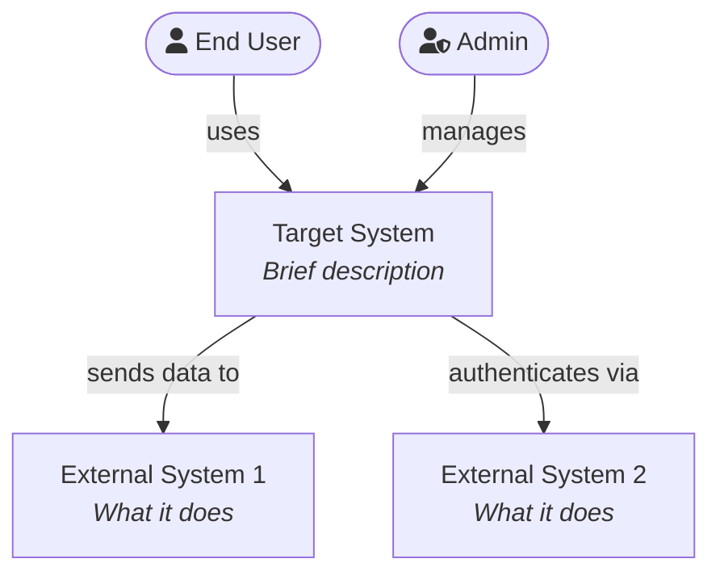
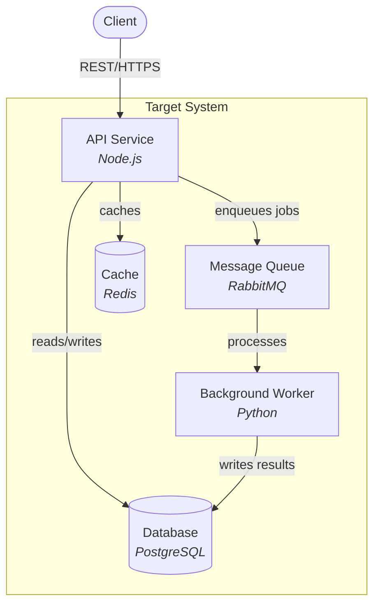
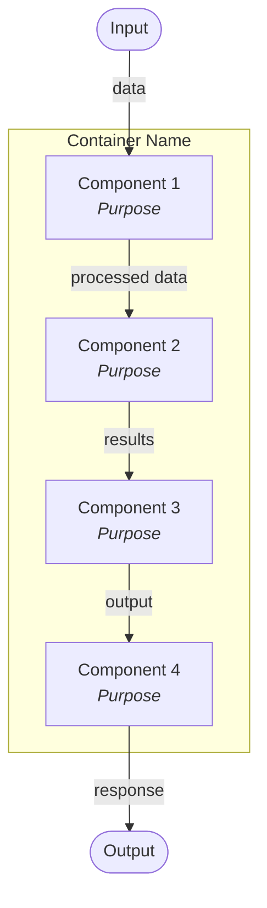

# C4 Diagram Generator

Generates C4 architecture diagrams at three levels of detail using Mermaid. Focuses on a specific system or subsystem that is architecturally significant.

## Usage

```
/design-c4 <system or subsystem name>
```

## Input Requirements

Read existing product documentation to identify:
1. **Target system/subsystem** — the component to diagram (e.g., "AI Screening Engine", "Payment Service")
2. **External actors** — users, systems, APIs that interact with it
3. **Internal structure** — services, containers, components from system design doc
4. **Data flows** — how data moves through the system

If no existing documentation is found, ask the user for the system context.

## Output Structure

Generate three levels of C4 diagrams, each with a Mermaid diagram and explanatory text.

### Level 1: System Context Diagram

Shows the system as a black box and its relationships with external actors and systems.



After the diagram, include a brief description of each actor and external system.

### Level 2: Container Diagram

Zooms into the target system showing its major containers (applications, services, databases, message queues).



After the diagram, include a table describing each container:

```markdown
| Container | Technology | Responsibility |
|---|---|---|
| API Service | Node.js | Handles REST requests, auth, validation |
| Worker | Python | Async processing of compute-intensive tasks |
```

### Level 3: Component Diagram

Zooms into the most architecturally significant container showing its internal components.



After the diagram, describe how the components work together in a numbered list (e.g., "How the [Component] Works"):

1. Step 1 — what happens and why
2. Step 2 — what happens next
3. ...

## Rules

- Use Mermaid `graph TB` for all C4 diagrams
- Each level must zoom into a subset of the previous level
- Level 1: system-level view (1 system box + external actors/systems)
- Level 2: container-level view (services, databases, queues within the system)
- Level 3: component-level view (internal structure of one container)
- Include technology labels in italics using `<i>` tags in node labels
- Use descriptive edge labels showing what flows between nodes
- Include brief explanatory text after each diagram
- Focus Level 3 on the most complex or architecturally interesting container
- All content in English
