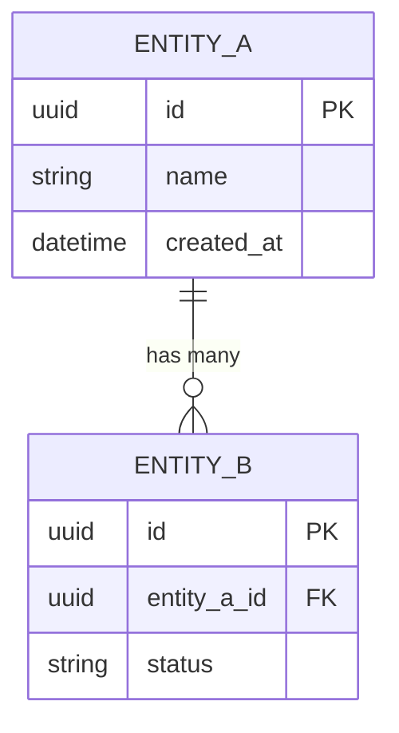

# Data Model Designer

Generates a comprehensive data model with ERD diagram, entity descriptions, and relationship documentation.

## Usage

```
/design-data-model <product name or context>
```

## Input Requirements

Read existing product documentation (product description, PRDs, use cases) to extract:
1. **Entities** — nouns from use cases and features (User, Order, etc.)
2. **Attributes** — key fields per entity
3. **Relationships** — how entities relate (1:1, 1:N, N:M)
4. **Business rules** — constraints that affect the model

If no existing documentation is found, ask the user for the domain context.

## Output Structure

Generate a section with three parts:

### Part 1: Entity-Relationship Diagram

Use Mermaid ERD syntax:



#### ERD Conventions

- Use `uuid` for primary keys (named `id`)
- Use `_id` suffix for foreign keys
- Include `created_at` and `updated_at` timestamps on all entities
- Use lowercase_snake_case for field names
- Mark PK and FK explicitly
- Relationship labels should be human-readable verbs

### Part 2: Entity Descriptions

A markdown table describing each entity:

```markdown
| Entity | Description | Key Attributes |
|---|---|---|
| EntityA | What it represents | id, name, status, ... |
```

### Part 3: Key Relationships

Document each relationship with:
- **Cardinality** — 1:1, 1:N, N:M
- **Description** — what the relationship means in business terms
- **Cascade rules** — what happens on delete (cascade, restrict, set null)
- **Indexes** — suggested indexes for query performance

Format:
```markdown
### Key Relationships

- **EntityA → EntityB** (1:N): A single EntityA can have multiple EntityBs. On delete: cascade.
- **EntityB ↔ EntityC** (N:M): Connected via `entity_b_entity_c` join table. On delete: restrict.
```

## Rules

- Derive entities from existing product documentation when available
- Use Mermaid `erDiagram` syntax exclusively (no external tools)
- Every entity must have a `uuid id PK`
- Include audit fields (`created_at`, `updated_at`) on every entity
- Foreign keys must reference existing entities
- N:M relationships require explicit join tables
- Keep the model normalized (3NF minimum) unless denormalization is justified
- Document 5-15 entities for a typical product (not too few, not too many for initial design)
- All content in English
