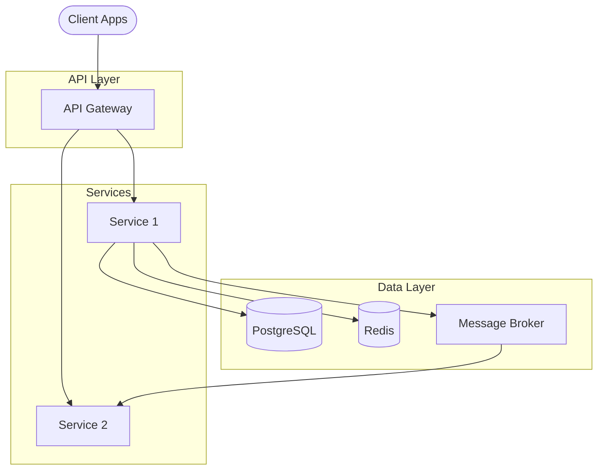

# System Design Generator

Generates a comprehensive high-level system design document covering architecture decisions, service decomposition, technology choices, and system diagrams.

## Usage

```
/design-system <product name or context>
```

## Input Requirements

Read existing product documentation to extract:
1. **Features and capabilities** — from product description and PRDs
2. **Data model** — from data model document
3. **Scale requirements** — from non-functional requirements in PRDs
4. **Integration points** — external systems and APIs

If no existing documentation is found, ask the user for the product context, expected scale, and key constraints.

## Output Structure

### Part 1: Architecture Overview

A 2-3 paragraph description of the chosen architecture style and why it fits the product. Cover:
- Architecture pattern (microservices, modular monolith, serverless, etc.)
- Communication patterns (sync REST, async events, gRPC, etc.)
- Deployment model (cloud, on-prem, hybrid)

### Part 2: Service/Module Decomposition

A markdown table listing each service or module:

```markdown
| Service | Responsibility | Tech Stack | Communication |
|---|---|---|---|
| API Gateway | Request routing, auth, rate limiting | Node.js / Kong | REST (inbound) |
| User Service | User management, authentication | Node.js + PostgreSQL | REST + Events |
```

### Part 3: Technology Stack

A comprehensive table covering all layers:

```markdown
| Layer | Technology | Rationale |
|---|---|---|
| Frontend | React / Next.js | SSR, ecosystem, hiring pool |
| API | Node.js / Kotlin | Performance, type safety |
| Database | PostgreSQL | ACID, JSON support, maturity |
| Cache | Redis | Low-latency reads, pub/sub |
| Message Broker | RabbitMQ / Kafka | Async processing, event sourcing |
| Search | Elasticsearch | Full-text search, analytics |
| Storage | S3 / GCS | File uploads, backups |
| CI/CD | GitHub Actions | Integration with repo |
| Monitoring | Prometheus + Grafana | Metrics, alerting |
| Logging | ELK Stack | Centralized log aggregation |
| Infrastructure | Kubernetes / ECS | Container orchestration |
```

### Part 4: Architecture Decisions Summary

A brief table linking to ADRs (generated separately by `/generate-adr`):

```markdown
| ADR | Decision | Status |
|---|---|---|
| [ADR-001](ADRs/ADR-001-title.md) | Microservices architecture | Accepted |
```

### Part 5: System Architecture Diagram

A Mermaid graph showing all components and their interactions:



## Rules

- Architecture choices must be justified with rationale, not just listed
- Technology choices should consider team size, hiring, ecosystem maturity
- The system diagram must show all services, databases, caches, queues, and external integrations
- Use Mermaid `graph TB` or `graph LR` for system diagrams
- Include infrastructure concerns: monitoring, logging, CI/CD
- Service boundaries should align with business domain boundaries (DDD-inspired)
- Keep the initial design pragmatic — avoid over-engineering for a product that hasn't launched
- All content in English
