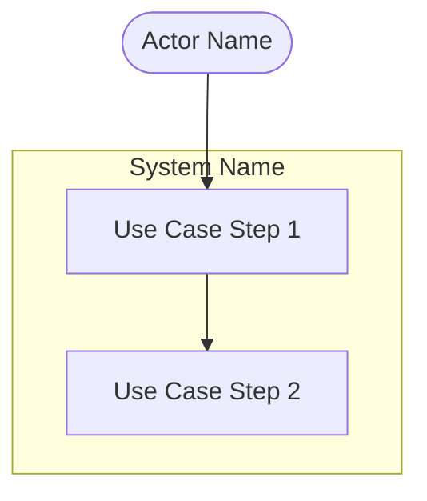
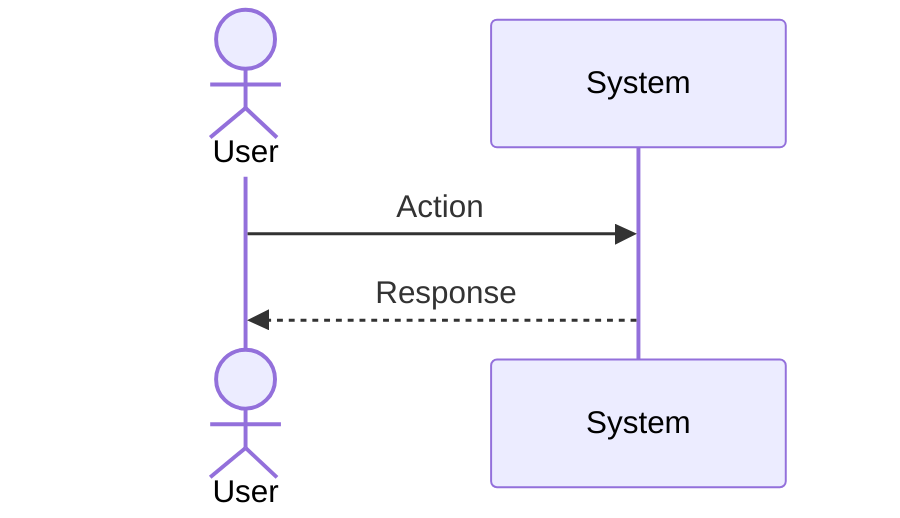

# Product Description Generator

Generates a comprehensive product description document covering the full discovery phase. The output is a single markdown file with all sections below.

## Usage

```
/product-description <product name or idea>
```

## Input Requirements

Ask the user for:
1. **Product name** — the name or working title
2. **Problem domain** — what problem space the product addresses
3. **Target users** — who will use the product (roles, personas)
4. **Key differentiators** — what makes this product unique (optional, can be brainstormed)

## Output Structure

Generate a single markdown document with the following sections in order:

### Section 1: Brief Description

1. **What Is [Product]?** — One paragraph describing the product vision and core value proposition.
2. **Value Proposition Table** — A markdown table mapping 3-5 pain points to how the product solves them:
   ```markdown
   | Pain Point | How [Product] Solves It |
   |---|---|
   | ... | ... |
   ```
3. **Competitive Advantages** — Analyze 3-5 existing competitors with their strengths and weaknesses. Then list 4-6 differentiators for the product.

### Section 2: Main Functions

1. **Prioritized Feature Table** — A markdown table with columns: Priority (P0/P1/P2), Feature, Description. P0 = MVP, P1 = post-MVP, P2 = complete offering.
2. **Functional Subsections** — Group features into 5-8 functional areas (e.g., "User Management", "Analytics"). Each subsection has 3-5 bullet points describing capabilities.

### Section 3: Lean Canvas

Generate a Lean Canvas covering all 9 blocks:
- Problem, Customer Segments, Unique Value Proposition
- Solution, Channels, Revenue Streams
- Cost Structure, Key Metrics, Unfair Advantage

Format as a markdown table or structured list. If Eraser.io or a diagram tool is available, suggest generating a visual version.

### Section 4: Main Use Cases

Generate 3 primary use cases. Each use case must include:

1. **Title** — descriptive name
2. **Actors** — who participates
3. **Description** — 2-3 sentence summary
4. **Preconditions** — what must be true before
5. **Main Flow** — numbered steps (6-10 steps)
6. **Postconditions** — what is true after
7. **Use Case Diagram** — Mermaid graph showing actors and system interactions
8. **Sequence Diagram** — Mermaid sequence diagram showing the flow

#### Mermaid Diagram Format

Use case diagram example:


Sequence diagram example:


## Rules

- Use Mermaid for all diagrams (no external image dependencies)
- Priority levels must be consistent: P0 (MVP), P1 (post-MVP), P2 (complete)
- Competitive analysis must reference real, existing products in the domain
- Use cases must be realistic and cover the most critical user journeys
- All content in English
- Use horizontal rules (`---`) between major sections
- Include a Table of Contents at the top with anchor links
