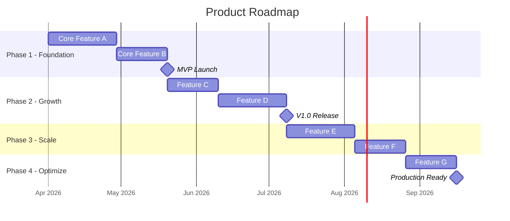

# Product Roadmap Generator

Generates a comprehensive product roadmap with Gantt chart, phase breakdowns, dependencies, and milestones.

## Usage

```
/product-roadmap <product name or context>
```

## Input Requirements

Read existing product documentation to extract:
1. **Features by priority** — P0/P1/P2 from product description
2. **PRD release plans** — phased delivery from PRDs
3. **Technical dependencies** — from system design and ADRs
4. **Team size estimate** — to calibrate timeline

If no existing documentation is found, ask the user for the product scope and constraints.

## Output Structure

### Part 1: Gantt Chart

A Mermaid Gantt chart showing all phases and major deliverables:



### Part 2: Phase Details

For each phase, provide:

```markdown
### Phase N: [Phase Name] (Weeks X-Y)

**Goal:** [One sentence describing the phase objective]

**Deliverables:**
- [Deliverable 1] — [brief description]
- [Deliverable 2] — [brief description]

**Dependencies:**
- [Dependency 1 must complete before Deliverable 2]

**Exit Criteria:**
- [ ] [Measurable criterion 1]
- [ ] [Measurable criterion 2]
```

Typically 3-4 phases:
1. **Foundation / MVP** — Core infrastructure + P0 features
2. **Growth / Enhancement** — P1 features + integrations
3. **Scale** — P2 features + performance + advanced capabilities
4. **Optimize / Production** — Hardening, monitoring, documentation

### Part 3: Key Milestones

A summary table of major milestones:

```markdown
| Milestone | Target Date | Description | Dependencies |
|---|---|---|---|
| MVP Launch | YYYY-MM-DD | Core features available for beta testing | Phase 1 complete |
| V1.0 Release | YYYY-MM-DD | Full feature set for GA | Phase 2 complete |
```

## Rules

- Use Mermaid `gantt` chart syntax exclusively
- Phases should align with feature priorities (P0 first, P1 second, P2 third)
- Each phase should be 4-8 weeks for a typical product
- Total roadmap should span 6-12 months
- Include milestones at the end of each phase
- Dependencies between deliverables must be explicit in the Gantt chart (use `after` keyword)
- Start dates should be realistic — default to next month if no date specified
- Deliverables should map to PRDs and feature groups
- Exit criteria must be measurable
- All content in English
- Use `dateFormat YYYY-MM-DD` and `axisFormat %b %Y` in Gantt charts
