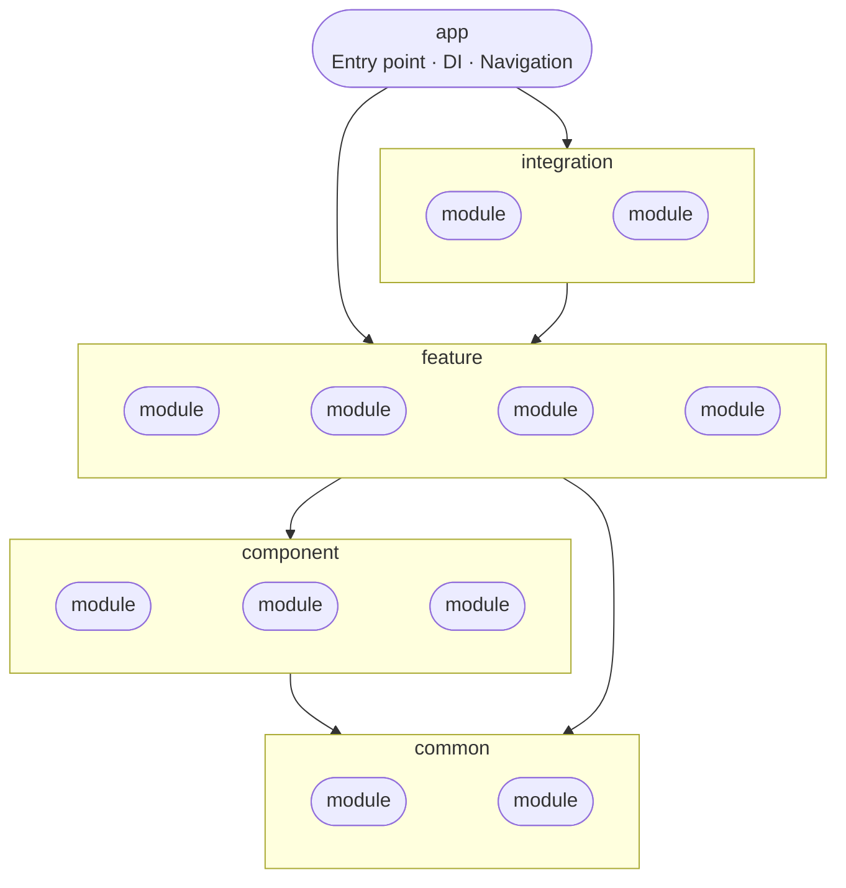

# DiviDox

DiviDox is a **dividend-focused stock portfolio tracker** for investors who want to understand and grow their passive income from equities. Built with Kotlin Multiplatform, it runs natively on Android, iOS, and Desktop (JVM) from a single shared codebase.

## What DiviDox does

### Portfolio management
View your holdings at a glance — current value, daily change, and total gain/loss since purchase. Add or remove positions manually, including purchase price, number of shares, currency, and date.

### Dividend analysis
Go beyond simple yield numbers. DiviDox surfaces dividend history, upcoming ex-dividend and payment dates, annual income projections per holding, and portfolio-wide dividend totals — giving dividend investors the detail they actually need.

### Watchlist
Follow tickers you don't own yet. Track price and dividend data for stocks you're evaluating before adding them to your portfolio.

### Account management
Manage your profile, base currency, and app preferences. Authentication via Google, Apple, or email/password through Firebase.

## Tech stack

Kotlin Multiplatform · Compose Multiplatform · Firebase Auth · Firestore · Yahoo Finance API · Material Design 3 · Koin · Clean Architecture

---

* [/composeApp](./composeApp/src) is for code that will be shared across your Compose Multiplatform applications.
  It contains several subfolders:
  - [commonMain](./composeApp/src/commonMain/kotlin) is for code that’s common for all targets.
  - Other folders are for Kotlin code that will be compiled for only the platform indicated in the folder name.
    For example, if you want to use Apple’s CoreCrypto for the iOS part of your Kotlin app,
    the [iosMain](./composeApp/src/iosMain/kotlin) folder would be the right place for such calls.
    Similarly, if you want to edit the Desktop (JVM) specific part, the [jvmMain](./composeApp/src/jvmMain/kotlin)
    folder is the appropriate location.

* [/iosApp](./iosApp/iosApp) contains iOS applications. Even if you’re sharing your UI with Compose Multiplatform,
  you need this entry point for your iOS app. This is also where you should add SwiftUI code for your project.

## Architecture

The project follows a layered modular architecture with strict dependency rules — each layer can only depend on layers below it.

### Rules

- `app` depends on everything.
- `feature` modules are isolated — they do not depend on each other.
- `common` modules have no internal dependencies.
- All modules target Android, iOS, and Desktop via Kotlin Multiplatform.

---

## How to test the app

Builds are produced automatically by the **On Distribute** CI workflow. No need to clone the repo or install any SDK.

### Step 1 — Download the build

1. Go to the **Actions** tab in this repository
2. Click **On Distribute** in the left sidebar
3. Click the latest successful run
4. Scroll to the bottom — **Artifacts** section
5. Download the artifact for your platform

---

### Android

**What you need:** an Android phone (Android 11 / API 31 or newer).

#### Option A — Firebase App Distribution (recommended)

The easiest way. Builds are pushed automatically on every release.

1. You need to be added to the **internal-testers** group — ask a maintainer to add your email in Firebase Console
2. You will receive an email from Firebase with a download link
3. Follow the link, install the Firebase App Tester app if prompted, and download the build directly from there

#### Option B — GitHub Actions artifact

1. Go to the **Actions** tab → **On Distribute** → latest run → **Artifacts** → download `composeApp-release.apk` *(expires after 90 days)*
2. Transfer it to your phone (Google Drive, USB cable, etc.)
3. Open the file on your phone
4. If prompted: **Settings → Install unknown apps** → allow your file manager or browser
5. Tap **Install**

---

### Desktop

**What you need:** nothing — just your computer.

1. Download the artifact for your OS *(expires after 90 days)*:
   - **macOS** → `.dmg`
   - **Windows** → `.msi` or `.exe`
   - **Linux** → `.deb` or `.AppImage`
2. Open the downloaded file and follow the installer
3. Launch **DiviDox** from your Applications folder / Start menu

---

### iOS

> The iOS build produced by CI is **unsigned**. It cannot be installed on a regular iPhone without a paid Apple Developer account. Two options:

#### Option A — iOS Simulator (Mac only)

**What you need:** a Mac with Xcode installed (free).

1. Download `iosApp-<build>.ipa` *(expires after 90 days)*
2. Rename it to `.zip` and unzip it — you will get a `.app` folder inside `Payload/`
3. Open Xcode → **Window → Devices and Simulators** → start any iPhone simulator
4. Drag and drop the `.app` folder onto the simulator window

#### Option B — Physical iPhone with TrollStore

**What you need:** an iPhone with a [TrollStore-compatible iOS version](https://ios.cfw.guide/installing-trollstore/).

1. Download `iosApp-<build>.ipa`
2. Transfer it to your iPhone
3. Open TrollStore → tap `+` → select the `.ipa` → **Install**

---

## How to build from source

See the [Development Setup](#) section below *(coming soon)*.

---

Learn more about [Kotlin Multiplatform](https://www.jetbrains.com/help/kotlin-multiplatform-dev/get-started.html)